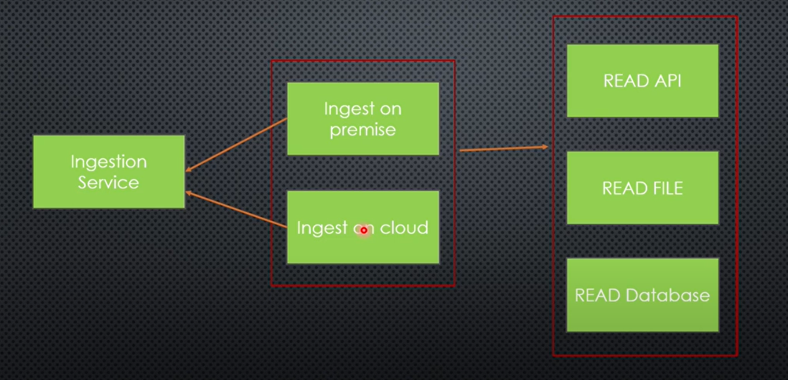

# Distributed Data Ingestion System

### Requirements

1. Fetch data from multiple source
2. new source cna be onboarded at any time without affecting any changes to existing sources
3. source can prodivde data using any method as per their conviences like file share, expose on api
4. we have large scale distributed system, so part of the data resides in the on-premis and some on cloud
5. decision to store data on permise orr cloud shold be made on the fly base on some parameter

### What we need ?
Read file from source and save it in storage.

1. Source: Read from API, Read File, Read Database or Kafka Topic
2. Storage: Ingest on Premise, Cloud or elsewhere

### Diagram
It'll be responsibility of the Ingestion Service to decide where to store the data.
